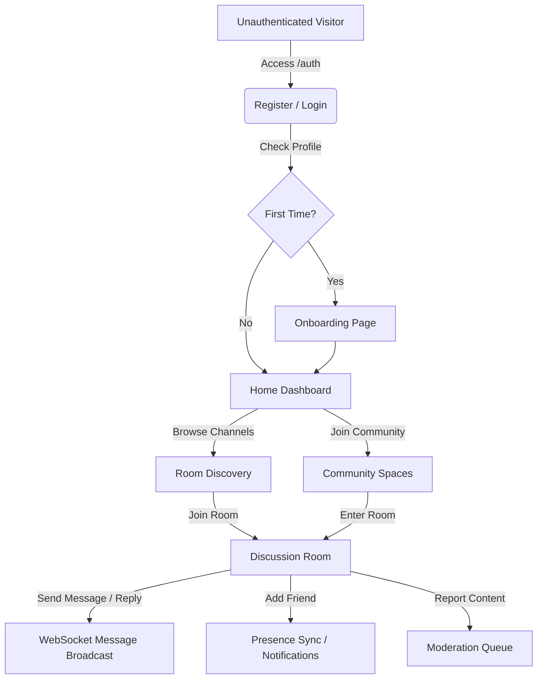

# Production-Level Architecture Audit: CONNECT Platform

This document presents a comprehensive, principal-level technical audit and refactoring roadmap for the **CONNECT** monorepo (express backend + React frontend).

---

## 1. Project Purpose & Product Breakdown

### 1.1 Core Problem Solved
CONNECT solves the fragmentation of discussion around online news articles and publications. Instead of reading an article on a news site and discussing it on general-purpose social networks (where context is lost) or in isolated comment sections, CONNECT links discussions directly to article URLs. It allows real-time community engagement, room discovery, and direct chat channels linked to normalized article references (designed to work alongside a browser extension).

### 1.2 User Personas
1. **General Users:** Read articles, join/create topic-specific or article-linked discussion rooms, send real-time messages/replies, react with emojis, build reputation, and maintain a friends network.
2. **Moderators:** Action user reports, review flagged messages, and moderate individual discussion rooms.
3. **Administrators / Superadmins:** Maintain platform settings, manage users and roles, delete communities/rooms, and inspect global analytics.

### 1.3 Major Features
- **URL-Linked Discussion Rooms:** Creation of rooms associated with normalized URLs (`Article` schema).
- **Communities:** Group-level namespaces (e.g., Tech, Politics) containing topic channels and membership controls.
- **Real-Time Messaging Engine:** Nested thread replies, emoji reactions (`👍`, `💡`), message editing, and deletion.
- **Real-Time Notification System:** Push notification delivery for replies and friendship actions.
- **Presence & Friends Network:** Bi-directional friendship flows with instant online/offline presence updates.
- **Moderation Queue:** Flagging of messages/rooms and state-based resolution of reports.
- **Admin Settings:** Global feature toggles (maintenance mode, rate limits, WebSocket toggles) stored in the database.

### 1.4 Complete End-to-End User Journey


---

## 2. Technology Stack Evaluation

| Technology | Purpose | Evaluation | Better Alternatives / Recommendation |
| :--- | :--- | :--- | :--- |
| **React 19** | Client rendering & UI | Used correctly. Taking advantage of the latest fiber reconciler. | Keep. Ensure all third-party UI libraries are fully compatible. |
| **Vite 6** | Frontend bundler | Correct. Provides sub-second HMR and optimized production bundles. | Keep. |
| **Tailwind CSS v4** | Core UI styling | Correct. Utilizes the new Rust-based compiler engine via `@tailwindcss/vite`. | Keep. |
| **Material UI (MUI)** | Component library | **Redundant Design Choice.** Having both Tailwind CSS and MUI installed creates styling conflicts, bloated bundle sizes, and visual inconsistency. | **Remove MUI.** Replace MUI icons with `lucide-react` (already installed) and custom Tailwind components. |
| **Redux Toolkit (RTK)** | Global state management | Correctly used for the main data store. | Keep as primary store if complex state is needed, or migrate fully to Zustand. |
| **Zustand** | State management | **Architectural Redundancy.** The codebase features duplicate Zustand stores (e.g., `useAuthStore` is unused) and custom hooks disguised as stores that wrap Redux dispatchers (e.g., `useRoomStore`). | **Eliminate the wrapper hooks.** Use Redux directly using standard RTK hooks, or completely replace Redux with pure Zustand to remove overhead. |
| **Express v5** | Backend web server | Correct. Express 5 natively handles rejected promises in handlers, preventing crashes on async routes. | Keep. |
| **Prisma ORM v6** | Database access / query building | Used correctly for query abstractions. | Keep. |
| **@prisma/adapter-pg** | PostgreSQL driver | **Over-engineered.** Using a JS driver adapter (`pg` pool adapter) instead of Prisma's native engine adds unnecessary overhead in a non-serverless Node.js environment. | **Use Native Prisma Client.** Revert to the native query engine for PostgreSQL. |
| **Socket.IO** | Real-time WebSockets | Correctly handles bi-directional events and room channels. | Keep. (Implement Redis Adapter for horizontal scaling). |
| **Zod** | Input validation | Correct. Applied on both HTTP router boundaries. | Keep. |

---

## 3. Folder Structure & Architecture Pattern

### 3.1 Folder Structure Layout
```
CONNECT
├── frontend
│   └── src
│       ├── components  # Layouts, shadcn UI components, feature-specific cards
│       ├── context     # React contexts (Theme Context)
│       ├── hooks       # Custom hooks (e.g., useAuth)
│       ├── pages       # Route view entrypoints (AdminDashboard, DiscussionRoom, etc.)
│       ├── services    # Axios client, socket connections
│       └── store       # Redux slices and mock Zustand wrapper hooks
└── server
    └── src
        ├── features    # Vertical feature slices (Domain + Use Cases + Presentation)
        │   └── [feature_name]
        │       ├── application  # Command / Query handlers (CQRS pattern)
        │       └── presentation # Express Routers
        ├── infrastructure       # Prisma DB client, Socket.IO server initialization
        ├── presentation         # Global middlewares (Auth, Error, Sanitizer)
        └── shared               # Custom AppError classes, EventBus, logs, sanitizers
```

### 3.2 Architectural Pattern
The backend is structured around a **Vertical Slice / CQRS Clean Architecture**:
- **Presentation Layer:** Express Routers in each feature slice map incoming HTTP requests to structural Commands or Queries, validating input payloads via `zod`.
- **Application Layer:** Commands and Queries are handled by isolated Use Case handlers (e.g., `JoinRoomHandler`, `RegisterHandler`). Dependencies are injected at the Composition Root (`server.ts`).
- **Infrastructure Layer:** Database access (Prisma) and socket adapters live here.
- **Shared Domain Events:** The codebase contains a publisher/subscriber `EventBus` and domain event classes (e.g., `MessageSentEvent`). However, **these events are never actually published or subscribed to**, representing a dead abstraction.

---

## 4. Technical Analysis

### 4.1 Frontend Analysis
- **Routing:** Handled via `react-router`. Routes are flat-mapped. There is no dedicated `<ProtectedRoute>` layout or wrapper; auth verification is done reactively inside layouts or pages.
- **State & Data Flow:** 
  1. A component triggers a method on a wrapper hook (e.g. `useRoomStore.sendMessage()`).
  2. The wrapper hook dispatches an asynchronous Redux Thunk (`sendMessageThunk`).
  3. The Thunk triggers an API call via Axios.
  4. The response updates the Redux slice state.
  5. The component re-renders based on the selector hook.
- **Socket Integration:** Real-time listeners are registered inside `useEffect` blocks at page boundaries (like `DiscussionRoom.tsx`) and correctly unsubscribed on component unmount.
- **Error Handling:** Try-catch wrappers are used inside operations, logging errors to the console or displaying user-friendly toast messages via `sonner`.

### 4.2 Backend Analysis
- **Request Lifecycle:**
  ```
  HTTP Request 
   ↓
  Express Middleware (Cors, Helmet, rateLimit, optionalJWT, sanitizeResponseMiddleware)
   ↓
  Feature Router (zod body validation)
   ↓
  Command/Query Handler Execution
   ↓
  Prisma Client Query execution (via PostgreSQL driver adapter)
   ↓
  sanitizeResponseMiddleware (traverses JSON response body to redact admin role if needed)
   ↓
  HTTP Response JSON / Error Middleware Handler
  ```
- **Authentication:** Stateless JWT verification. If present, it attaches user metadata (`id`, `username`, `role`) to `req.user`.
- **Response Sanitization:** The `sanitizeResponseMiddleware` intercepts `res.json` and recursively scans payloads. If it identifies a user object, it checks the role. If the target is an admin and the requester is a regular user, the role is obfuscated to `"user"` and admin badges are stripped.

### 4.3 Database Schema & Relationship Audit
- **Models:** Relational structure containing `User`, `Community`, `Room`, `Message`, `Reaction`, `Notification`, `Report`, `Activity`, `Friendship`.
- **Cascade Rules:** Configured correctly on physical deletes (e.g., deleting a User cascades to `Friendship`, `RoomMember`, `Message`).
- **CRITICAL BOTTLENECK - Missing Database Indexes:**
  The Prisma schema defines standard `@id` and `@unique` values, but **fails to index foreign key columns**. As a result, PostgreSQL does not create indexes for:
  - `Message.roomId` & `Message.parentId`
  - `Reaction.messageId`
  - `Room.communityId` & `Room.createdById`
  - `Notification.userId`
  - `Report.reportedUserId`, `Report.messageId`, `Report.roomId`
  - `Activity.userId` & `Activity.roomId`
  
  **Consequences:** Every time a user enters a discussion room, fetching messages (`findMany({ where: { roomId } })`) or notifications will trigger a **sequential table scan**. As message volume grows, chat rooms will become extremely sluggish.

### 4.4 Real-Time Architecture Audit

```
Tab 1 Connects (token sent)  ──>  Auth Middleware Verification  ──>  Status Set 'online'
                                                                           │
                                                                           ├─> Broadcast 'friend_online'
                                                                           └─> userSockets.get(userId).add(socket.id)
```

- **In-Memory Tracking:** Real-time socket states are managed in-memory using JavaScript maps:
  - `userSockets`: `Map<string, Set<string>>` mapping `userId` to socket IDs.
  - `roomActiveUsers`: `Map<string, Map<string, { user, sockets: Set }>>` mapping `roomId` to active room users.
- **Multi-Tab Synchronization:** Supported correctly by keeping a `Set` of socket IDs per user. The user is only marked offline once the set is empty.
- **Real-Time Event Flows:**
  - **Presence:** Connections trigger a DB write (`status: 'online'`) and emit `friend_online` to online friends. Disconnections do the inverse.
  - **Rooms:** Clients emit `join_room` / `leave_room` to sync presence list.
  - **Messaging:** Messages created via REST API trigger `io.to(roomId).emit('new_message')` in the command handler.
- **Critical Scaling Defect:** Because user socket sets and active room lists are kept in-memory, **horizontal scaling is impossible**. Adding a second backend instance will split the connections, causing users on Server A to be invisible to users on Server B, and failing to deliver socket broadcasts.

---

## 5. Architectural & Code Smells Review

1. **Active Stats Database Storm (Critical Performance Bug):**
   In `SocketServer.ts` (inside the `connection` and `disconnect` listeners) and `GetStatsQuery.ts`, the application fetches dashboard statistics:
   ```typescript
   // Inside a loop running 7 times (for the past 7 days):
   const [dayMessages, dayUsers] = await Promise.all([
     prisma.message.count({ where: { createdAt: { gte: startOfDay, lte: endOfDay } } }),
     prisma.user.count({ where: { createdAt: { gte: startOfDay, lte: endOfDay } } })
   ]);
   ```
   **Why it's wrong:** Every single time a user logs in, logs out, or refreshes the homepage, the backend executes **14 separate database count queries** over message and user tables. Under load, this will trigger a database connection pool starvation and crash PostgreSQL.
   
2. **First-N Limit in Queries (Trending & Hot Rooms Bug):**
   In `RoomQueries.ts` (`GetTrendingRoomsHandler` and `GetHotRoomsHandler`), the code fetches rooms like this:
   ```typescript
   const rooms = await prisma.room.findMany({ include: { ... }, take: 20 });
   const roomsWithCounts = await attachMessageCounts(rooms, ...);
   return roomsWithCounts.sort(...).slice(0, 10);
   ```
   **Why it's wrong:** The query pulls the *first* 20 rooms (using default insertion order) and then sorts them in-memory. If the room with the highest active user count or message volume is the 21st record in the database, it will never show up in the Trending or Hot list.
   
3. **Dead Code & Unused Abstractions:**
   - The entire `EventBus` (`server/src/shared/event-bus/EventBus.ts`) is fully implemented but never utilized.
   - Message domain event classes (`MessageSentEvent`, `MessageUpdatedEvent`, etc.) are defined but never published.
   - `ActivityLog` table is written to on room creation but never queried or displayed anywhere.
   
4. **State Management Overhead (RTK + Mock-Zustand Redundancy):**
   `useRoomStore.ts` and `useNotificationStore.ts` are styled like Zustand stores but are custom React hooks dispatching Redux actions. This adds unnecessary boilerplate, double-nesting, and confusion for new developers.

---

## 6. Architecture Audit (Mistakes & Improvement Levels)

### 6.1 Beginner Mistakes
- **No Production Path Mapping Resolution:** 
  The compiled backend uses TypeScript path aliases (`@infrastructure/...`). At runtime, standard Node (`node dist/server.js`) fails to resolve these paths and crashes immediately. No bundler or path-rewriting tool (`tsc-alias`) is used in the build pipeline.
- **Faked Real-Time Metrics:**
  In `RoomCard.tsx`, the client fakes the active room count if it's undefined:
  `const activeNow = room.activeNow ?? Math.ceil(memberCount * 0.4);`
  This is a mock calculation hiding missing real-time sync states.
- **Hardcoded Auth Secrets:**
  The `JWT_SECRET` falls back to `'newsconnect-secret-key-change-in-production'` if the environment variable is not defined, leading to weak security out-of-the-box.

### 6.2 Intermediate Improvements
- **Replace Body-level Response Sanitization:**
  Dynamic recursive scanning of all JSON response bodies via JS middleware is slow. Replace this with Prisma selection models (`select` or `omit`) to ensure sensitive properties never leave the database query layer.
- **Centralize Authorization Checks:**
  Role verification is scattered across presentation routes (e.g., `req.user!.role !== 'superadmin'`) and commands. Create a declarative route authorization middleware (e.g., `restrictTo('admin', 'superadmin')`).
- **Implement Database Seeding Validations:**
  Ensure system settings keys are strictly typed and validated (e.g., rate limits must be integers, toggles must be booleans) rather than allowing raw string writes.

### 6.3 Advanced Improvements
- **Database Index Optimization:**
  Add foreign key indexes to `schema.prisma` to prevent sequential table scans:
  ```prisma
  model Message {
    ...
    @@index([roomId])
    @@index([parentId])
  }
  ```
- **Caching & Stats Aggregation:**
  Do not compute 7-day stats dynamically. Write a cron job or background worker that aggregates stats hourly and caches them in Redis or a dedicated `DailyStatistic` table.
- **State Management Consolidation:**
  Discard Redux Toolkit. Refactor state management to use pure **Zustand** stores, reducing frontend boilerplate by 60%.

### 6.4 Enterprise Scale Adaptations

```
                     ┌───> Express Node Instance 1 (Server A) ───┐
                     │                                           │
Load Balancer (Nginx)├───> Express Node Instance 2 (Server B) ───┼─> Redis Adapter (Socket.IO Pub/Sub)
                     │                                           │
                     └───> Express Node Instance 3 (Server C) ───┘
```

#### For 10,000 Concurrent Users:
- **WebSocket State Separation:** Replace in-memory Maps (`userSockets`, `roomActiveUsers`) with **Redis Hash sets**. This allows stateless horizontal scaling.
- **Connection Pooling:** Configure Prisma database connection pool limits and configure a database proxy (e.g., PgBouncer) to handle PostgreSQL connection overhead.

#### For 100,000 Concurrent Users:
- **Socket.IO Scaling:** Integrate `@socket.io/redis-adapter` so socket events broadcasted from Server A are forwarded to clients connected to Server B.
- **Read-Write Splitting:** Introduce PostgreSQL read replicas. Command handlers write to the primary instance, while Query handlers load balance reads across read replicas.

#### For 1,000,000 Concurrent Users:
- **Database Partitioning:** Partition the `messages` and `activities` tables by `roomId` or `createdAt` ranges to keep tables queryable.
- **Serverless/Microservices Migration:** Separate real-time chat servers (Node/WebSockets) from the REST API endpoints. Migrate to dedicated instances, allowing the chat server to scale independently based on connection volume.

---

## 7. Security Review

- **Stateless JWT Logout (Session Poisoning):**
  Logout commands only set `status: 'offline'` in the database. The JWT remains cryptographically valid and can be intercepted and used to hit endpoints until its 7-day expiration.
  *Solution:* Implement a short token lifetime (e.g., 15 minutes) with a refresh token workflow, or keep a Redis blocklist of logged-out tokens.
- **Permissive CORS:**
  `app.use(cors())` runs with default settings, exposing all endpoints to any origin (`Access-Control-Allow-Origin: *`).
  *Solution:* Restrict CORS to trusted origins defined in environment variables.
- **Input Sanitization (XSS):**
  The client renders raw text using standard React bindings which escapes HTML natively. However, there is no HTML validation on backend string fields, allowing malicious markdown or scripts to be saved to the database.
- **Unrestricted Rate Limits:**
  The `apiLimiter` limits requests to 300 per 15 minutes per IP. However, certain heavy endpoints (like `/api/auth/register`, `/api/auth/login`, and `/api/stats`) are not rate-limited separately, leaving the authentication system vulnerable to brute-force attacks.

---

## 8. Performance Review

- **Statistics Generation CPU Blocking:**
  Dynamic execution of sequential database counts (`Promise.all` inside a loop) blocks the single-threaded Node.js event loop during high concurrent connections, reducing overall server throughput.
- **Bundle Bloat:**
  Including both `@mui/material` and Tailwind CSS v4 in the client package results in a large bundle size, slowing initial page load times.
- **Response Traversing Latency:**
  Using runtime recursion (`sanitizePayload`) on large JSON arrays of messages causes high CPU usage and garbage collection pauses.

---

## 9. Final Architecture Report Card

| Metric | Score | Key Rationale |
| :--- | :--- | :--- |
| **Overall Architecture** | **6.5 / 10** | Strong clean CQRS setup on the backend, but heavily compromised by unused abstractions, duplication on the frontend, and severe database/real-time scaling bottlenecks. |
| **Frontend Architecture** | **5.5 / 10** | Double-styling frameworks (Tailwind + MUI) and a confusing state wrapper hook architecture that mimics Zustand while calling Redux underneath. |
| **Backend Architecture** | **7.5 / 10** | Solid separation of routing and Command/Query handlers. Express 5 usage is modern, but let down by dead EventBus code and dynamic body-traversal middleware. |
| **Database Design** | **5.0 / 10** | Good relational integrity, but completely lacks index optimizations on foreign keys, leading to full table scans. |
| **Realtime Architecture**| **5.0 / 10** | Real-time features work fine on a single node, but are built entirely on in-memory maps, making horizontal scaling impossible. |
| **API Design** | **8.0 / 10** | REST conventions are clear, input validation is enforced via Zod, and error responses are consistent. |
| **Scalability** | **3.0 / 10** | Unscalable in-memory socket state tracking, dynamic statistics DB storms, and lack of database indexes. |
| **Security** | **6.0 / 10** | Basic protections (Rate limit, Helmet, bcrypt) are present. Vulnerable to stateless token hijacking, wide-open CORS, and brute-force register attempts. |
| **Maintainability** | **6.5 / 10** | Clean folders make navigation easy, but dead event code and state wrapper layers add unnecessary complexity. |
| **Code Quality** | **7.0 / 10** | Strict TypeScript configuration, descriptive naming conventions, and consistent use of modern Express/React APIs. |

---

## 10. Refactoring Roadmap

### Priority 1: Critical Stability & Security (Immediate Action)
1. **Fix Production Path Resolving:**
   *Action:* Install `tsc-alias` and update backend build scripts to translate path aliases back to relative routes:
   `"build": "tsc && tsc-alias"`
   *Impact:* Crucial. Prevents the production container/server from crashing on boot.
   *Difficulty:* Easy.
   
2. **Add Missing Database Indexes:**
   *Action:* Update `schema.prisma` to include explicit `@@index` references on all foreign keys (`Message.roomId`, `Message.parentId`, `Reaction.messageId`, etc.) and run migration.
   *Impact:* High. Replaces sequential scans with index scans, keeping query times under 5ms.
   *Difficulty:* Medium.
   
3. **Optimize / Remove DB Stats Storm:**
   *Action:* Remove the 7-day query loop from WebSocket connection handlers. Cache statistics inside a global variable (or Redis) and update it periodically, rather than querying PostgreSQL dynamically for every connect/disconnect event.
   *Impact:* High. Restores DB stability during high connection spikes.
   *Difficulty:* Medium.

### Priority 2: Technical Debt & Maintainability (Next Development Cycle)
4. **Remove Frontend State Wrapper Redundancy:**
   *Action:* Delete the mock Zustand hooks (`useRoomStore.ts`, `useNotificationStore.ts`) and use Redux Toolkit hooks (`useAppDispatch`, `useAppSelector`) directly, OR fully migrate state logic to clean **Zustand** stores.
   *Impact:* High. Cleans up client state architecture and reduces boilerplate.
   *Difficulty:* Medium.
   
5. **Decouple Styling Libraries:**
   *Action:* Remove `@mui/material` and `@emotion/styled`. Rewrite the few MUI components in pure Tailwind CSS using Lucide icons.
   *Impact:* Medium. Decreases frontend bundle size by up to 40% and simplifies styling rules.
   *Difficulty:* Medium.
   
6. **Move Response Sanitization to Database Layer:**
   *Action:* Remove `sanitizeResponseMiddleware` and rewrite query select statements to omit sensitive user properties (like roles) on client queries, preventing runtime recursive scans.
   *Impact:* High. Reduces API response latency and node CPU load.
   *Difficulty:* Medium.

### Priority 3: Feature Enhancements & Advanced Scaling (Future Roadmap)
7. **Stateless WebSockets with Redis Adapter:**
   *Action:* Install Redis and integrate `@socket.io/redis-adapter` into `SocketServer.ts`. Replace in-memory Maps with Redis hash stores.
   *Impact:* Essential for scaling beyond a single server instance.
   *Difficulty:* High.
   
8. **Remove Dead EventBus & Domain Event Abstractions:**
   *Action:* Delete `EventBus.ts` and the `events/MessageEvents.ts` folder if they are not going to be utilized, or implement them properly for cross-feature notifications.
   *Impact:* Low. Cleans up unused files in the codebase.
   *Difficulty:* Easy.
