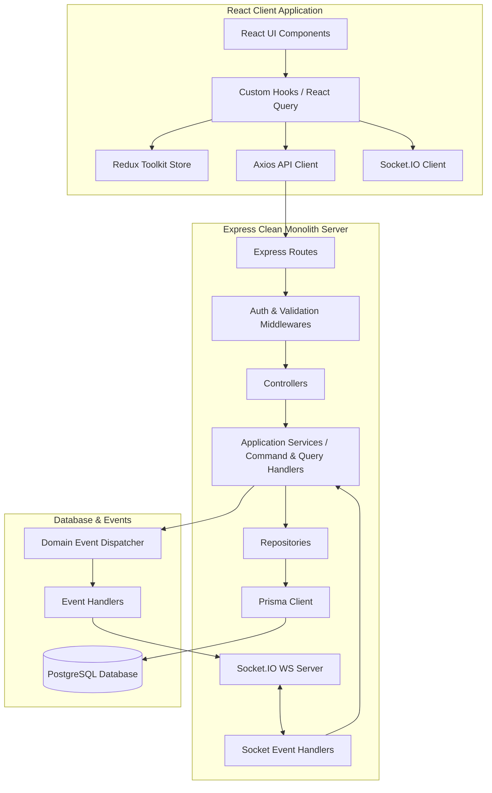
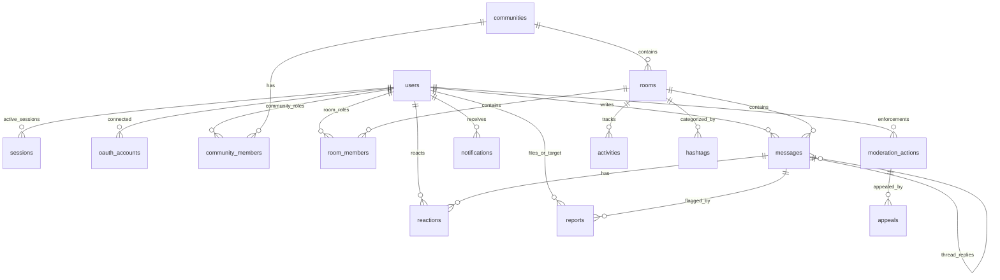
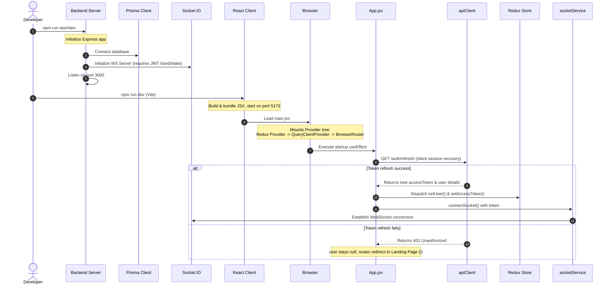
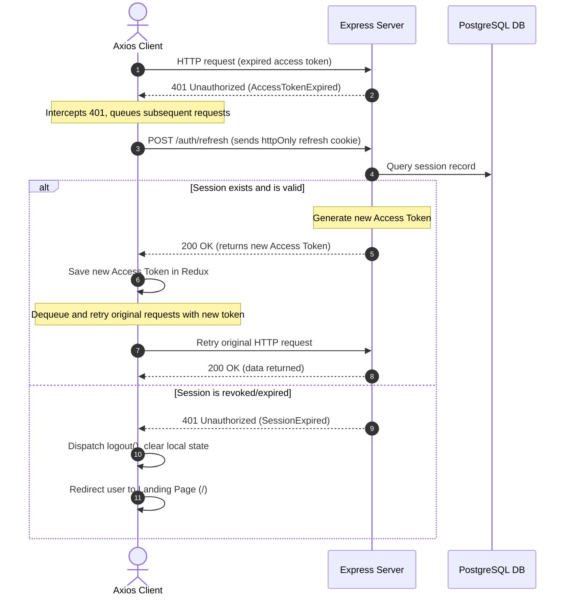
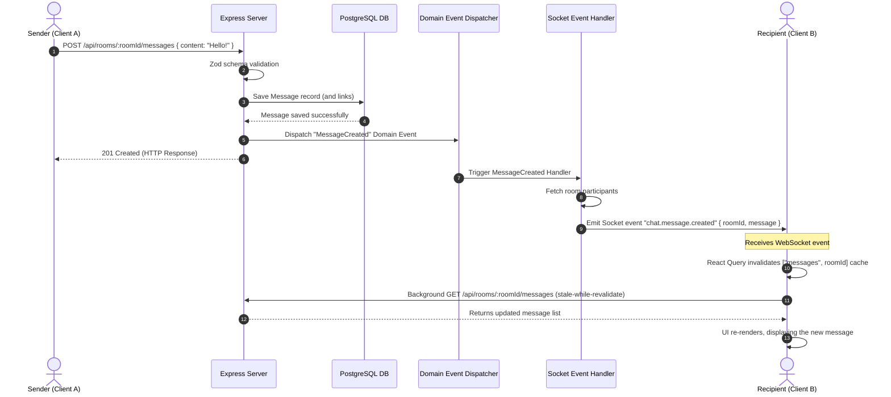

# CONNECT v2 — Comprehensive System Architecture & Developer Reference Manual

Welcome to the internal engineering guide for **CONNECT**. This document details the end-to-end architecture, database structures, data flow pipelines, and technical design patterns governing both the frontend React client and the backend Node/Express clean monolith server.

---

## 1. High-Level Architectural Overview

CONNECT is built as a real-time, interest-driven discussion platform. It coordinates synchronous communication (WebSockets), resilient database persistence (PostgreSQL via Prisma ORM), and client-side server-state management (React Query) under a clean, layered architectural design.



### Core Design Paradigms
1. **Clean Monolith Backend**: Feature-grouped folders containing dedicated route-to-repository layers. Business rules are strictly isolated from HTTP layers and database schemas.
2. **CQRS-Inspired Architecture**: Distinct command handlers for state-changing operations and query handlers for data retrieval, enabling predictable side-effects, policy-based authorization, and decoupled event handling.
3. **Unidirectional UI Data Flow**: Component interactions dispatch commands through Axios or trigger WebSocket events, which modify the database state. Real-time broadcasts or queries invalidate local React Query caches, prompting React components to re-render.
4. **Database-First Real-time Sync**: The database is the single source of truth. No WebSockets broadcast data until it has been safely committed to the database and processed by backend Event Handlers.

---

## 2. Technology Stack Breakdown & Internal Mechanics

### A. Frontend (React, Redux, React Query, Axios)
- **Vite & React**: Vite provides hot module replacement (HMR) and fast build bundling. React handles component renders declaratively using fiber reconciliation.
- **Redux Toolkit**: Manages synchronous global *client-only state* (such as the authenticated user object, user restriction/mute states, active UI toggles, and access token). Server state (like messages, rooms, and profile data) is intentionally excluded from Redux to prevent duplication.
- **React Query (TanStack Query)**: Handles all *asynchronous server-state caching*. It automates caching, background revalidation (stale-while-revalidate), retry mechanisms, and pagination cursors.
- **Axios**: Standardized HTTP client. Configured with a request interceptor to attach JWT access tokens, and a response interceptor that implements automatic token rotation via token queues when encountering `401 Unauthorized` responses.
- **Framer Motion (`motion/react`)**: Powering key interactive UI animations like the constellation visualizer in `LandingAtlas` and smooth page transitions.

### B. Backend (Node.js, Express.js, Prisma, Socket.IO)
- **Node.js & Express**: Provides a lightweight HTTP server. Employs middleware chains to handle JWT authorization, Zod validation, and centralized exception logging.
- **Prisma ORM**: Directs type-safe database queries. Prisma generates a client wrapper mapping directly to PostgreSQL schemas, mitigating SQL-injection surfaces and N+1 query patterns.
- **PostgreSQL**: Relational database chosen for strict transactional safety (ACID compliance) and complex relational integrity (e.g. cascading deletions on rooms, posts, and user relationships).
- **Socket.IO**: Employs WebSocket-based communication with automatic HTTP long-polling fallback. Enforces token handshakes on client connection, maps sockets to target channels (like `room:id` and `user:id`), and coordinates real-time event broadcasts.

---

## 3. Server-Side Layered Clean Architecture (CQRS & DDD)

The server codebase implements a **CQRS-inspired clean architecture** grouped by domain features. Each HTTP request traverses a rigid pipeline:

```
Request 
 ↳ Express Router (e.g., /api/rooms)
   ↳ Zod Validation Middleware (validates request body/query schemas)
     ↳ Controller (extracts params, maps to Command/Query)
       ↳ Command / Query Handler (executes business logic, checks Policies)
         ↳ Repository (abstracts database operations)
           ↳ Prisma Client (queries PostgreSQL)
             ↳ Domain Events (publishes events on the EventBus)
               ↳ Event Subscribers (react asynchronously or broadcast via Sockets)
                 ↳ Response (HTTP status & data returned to Client)
```

### Business Logic Flow Example (CreateRoomCommand):
1. **Controller Entry**: Receives `POST /api/rooms` containing `title`, `description`, etc. Enforces Zod validation. Maps request payload to a new `CreateRoomCommand` instance.
2. **Handler Execution**: The `CreateRoomHandler` executes the command. It checks if the title exists, validates category and tag constraints, performs policy verification using `RoomPolicy.canCreateRoom()`, and runs the creation query within a database transaction.
3. **Repository Persistence**: Calls `RoomRepository.create()` to interact with the Prisma client.
4. **Domain Event Dispatching**: After a successful write, it publishes a `RoomCreatedEvent` on the central `EventBus`.
5. **Event Handlers**: The subscriber `RoomEventSubscribers` catches the event and emits a real-time `room.created` Socket.IO broadcast, alerting all listening clients to update their room discovery feeds.

### Server Directory Structure
- [src/config/](file:///Users/sahil/Desktop/INFOSTRIDE/VSCODE/CONNECT/server/src/config): Holds environment variables and dynamic configuration validation schemas.
- [src/infrastructure/](file:///Users/sahil/Desktop/INFOSTRIDE/VSCODE/CONNECT/server/src/infrastructure): Connects external drivers (Prisma database client, Socket.IO server, Email notification service).
- [src/presentation/](file:///Users/sahil/Desktop/INFOSTRIDE/VSCODE/CONNECT/server/src/presentation): Global route mounting, authentication middleware (`AuthMiddleware.js`), error middleware, request sanitizers, and request logger.
- [src/shared/](file:///Users/sahil/Desktop/INFOSTRIDE/VSCODE/CONNECT/server/src/shared): Common reusable classes and utilities (centralized `EventBus`, standard custom exceptions like `AppError`, hash/cryptography functions, sanitizer, and policy base classes).
- [src/features/](file:///Users/sahil/Desktop/INFOSTRIDE/VSCODE/CONNECT/server/src/features): Enforces strict domain segregation:
  - `auth`: Handles session creation, token issuance (access/refresh tokens), encryption, OAuth login integrations (GitHub, Google), and password recovery.
  - `user`: Manages user profile retrieval, updates, password changes, avatar cropping and uploads, and role authorizations.
  - `room`: Controls rooms creation, updating, archiving, deletions, and participant states.
  - `community`: Coordinates community spaces, community-member joins/roles, categorizations, and localized activity feeds.
  - `discovery`: Powering room search via Prisma text matching, tag query, and real-time room discovery socket updates.
  - `message`: Manages text messages, attachments, threads, reaction handlers, and real-time message broadcasting.
  - `social`: Coordinates friendships, pending requests, user blocks, notifications generation, and presence tracking.
  - `moderation`: Handles moderation reports/flags against users, rooms or messages, moderator assignments, bans/restrictions, and appeals resolution.
  - `analytics`: Tracks page visits, activity feeds, reputation logs, and platform-wide dashboard stats.

---

## 4. Database Schema & Key Entities

CONNECT persists all core features to a PostgreSQL relational database using [schema.prisma](file:///Users/sahil/Desktop/INFOSTRIDE/VSCODE/CONNECT/server/prisma/schema.prisma). Below are the primary entity groups:



### Key Models and Relationships
1. **Identity & Session Management**:
   - `User`: Holds identity attributes (`email`, `username`, credentials), security logs, lockout status, reputation score, pause flags, and global roles (`MEMBER`, `MODERATOR`, `ADMIN`).
   - `Session`: Handles session tracking, mapping tokens to device info and expiration time to enable secure token rotation and global logout revocation.
   - `OAuthAccount`: Maps external authentication tokens (Google, GitHub) to internal user profiles.

2. **Rooms & Communities Structure**:
   - `Community`: Represents themed community spaces.
   - `CommunityMember`: Multi-to-multi mapping of users to communities, enforcing community-specific moderator/member roles.
   - `Room`: Individual chat and discussion hubs. Can stand alone or belong to a community. Rooms map to `Article` (if created from a news link) and hold hashtags.
   - `RoomMember`: Tracks participants in a room and room-level moderators (`ROOM_MOD`).

3. **Discussion & Messaging**:
   - `Message`: The core chat message entity. Supports nesting (replies) via self-referencing `parentId` and soft deletion.
   - `Reaction`: Stores unique user reactions (emojis) mapped to messages.

4. **Social & Communication**:
   - `Friendship`: Relates two users to track friendship statuses (`pending`, `accepted`).
   - `Block`: Resolves user-to-user blocking relationships.
   - `Notification`: Stores persistent user notifications triggered by message replies, mentions, or social invitations.

5. **Moderation System**:
   - `Report`: Flags filed by reporters against messages, users, rooms, or communities. Can be assigned to moderators.
   - `ModerationAction`: Keeps record of active enforcements (mutes, bans) issued by moderators/admins against users, with optional expiration times.
   - `Appeal`: Submitted by restricted users requesting resolution on actions.

---

## 5. Client-Side Directory Structure

The React client app is organized to enforce a strict boundary between UI rendering, business hooks, and API services:

```
client/src/
 ├── components/
 │    ├── features/      # Feature-specific layouts (e.g. landing/LandingHero.jsx)
 │    ├── layout/        # Global page frames (Navbar.jsx, AppLayout.jsx, DashboardHeader.jsx)
 │    ├── shared/        # Shared components (MessageCard.jsx, RoomCard.jsx, StatCard.jsx, Avatar.jsx, Badge.jsx)
 │    └── ui/            # Primitive design system components (button, card, dialog, dropdown-menu, input, select, skeleton, sonner, spinner, tabs, textarea)
 ├── context/            # Shared React context modules (e.g. ThemeContext)
 ├── hooks/              # Custom business hooks (useAuth, useSocial, useRooms, useMessages, useGlobalSocketEvents)
 ├── pages/              # Route entry components (HomeDashboard, WorldChatPage, DiscussionRoom, etc.)
 ├── services/           # Network clients (apiClient interceptors, socketService)
 ├── store/              # Redux slices (authSlice, reputationSlice, uiSlice) and store setup
 ├── styles/             # Global CSS files (index.css, App.css)
 └── utils/              # Client-side utility functions (tree helpers, cn classmerger)
```

---

## 6. End-to-End Execution & Data Sequences

### A. Bootstrapping Flow (Startup)
When `npm run dev` is executed on the frontend and the backend server starts:



---

### B. Authentication & Token Lifecycle

CONNECT implements standard **JWT session security** using two tokens:
1. **Access Token (Short-lived)**: JSON Web Token containing user ID, role, and username. Transmitted via the HTTP `Authorization: Bearer <token>` header.
2. **Refresh Token (Long-lived)**: Random high-entropy token stored in a database session record and stored in the user's browser inside a secure, `httpOnly`, `SameSite=Strict` cookie. Prevents client-side scripts from reading the refresh token, protecting against Cross-Site Scripting (XSS) attacks.

#### Silent Token Rotation Interceptor Flow
If the short-lived access token expires, the client's Axios response interceptor intercepts the error and resolves it silently:



---

### C. Message Publication & Real-Time Sync Flow

This flow illustrates how a user sends a message in a discussion room and how all other participants receive it instantly:



---

## 7. Critical Security & Performance Guidelines

### A. Preventing N+1 Database Query Overhead
- **Problem**: Querying a list of records (e.g. 20 rooms) and subsequently initiating a database call for each record to fetch its author/replies results in 21 round-trips to the database.
- **Solution**: Always use Prisma's `include` or `select` parameters during the initial query to pre-join tables in PostgreSQL in a single query:
  ```javascript
  prisma.room.findMany({
    include: {
      user: { select: { username: true, avatar: true } },
      _count: { select: { messages: true } }
    }
  });
  ```

### B. Avoiding State Duplication
- Keep server-returned data (messages, active rooms, user lists) inside **React Query**.
- Do not copy server-side query results into the Redux store. Storing server state in Redux creates synchronization bugs and bypasses React Query's garbage collection and automatic caching invalidation.
- Redux must remain dedicated strictly to **client-only local state** (e.g., active modal toggles, client themes, userRestriction/mute overlays, and active access tokens).

### C. Clean WebSocket Disconnections
- Always register event listeners inside React `useEffect` hooks, and ensure that the cleanup function cleans up the listener:
  ```javascript
  useEffect(() => {
    const socket = getSocket();
    const handleEvent = (data) => { ... };
    
    socket.on("custom_event", handleEvent);
    return () => {
      socket.off("custom_event", handleEvent); // Prevents memory leaks
    };
  }, []);
  ```
- Any global WS actions or notifications should be handled in [useGlobalSocketEvents.js](file:///Users/sahil/Desktop/INFOSTRIDE/VSCODE/CONNECT/client/src/hooks/useGlobalSocketEvents.js) rather than duplicated across individual components.
