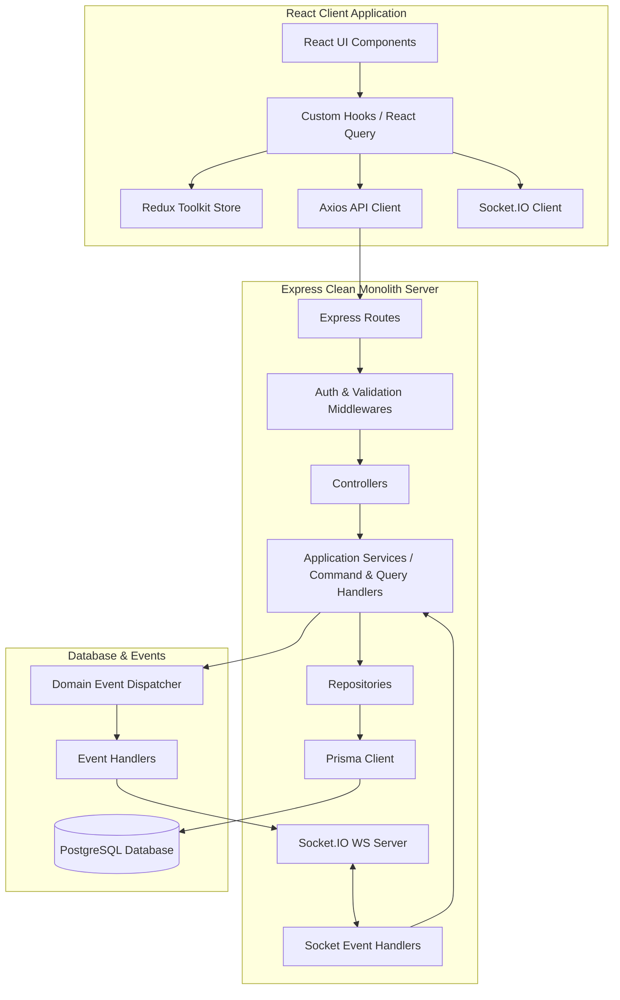
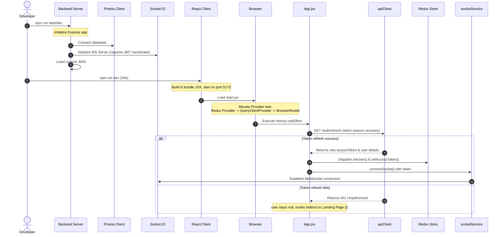
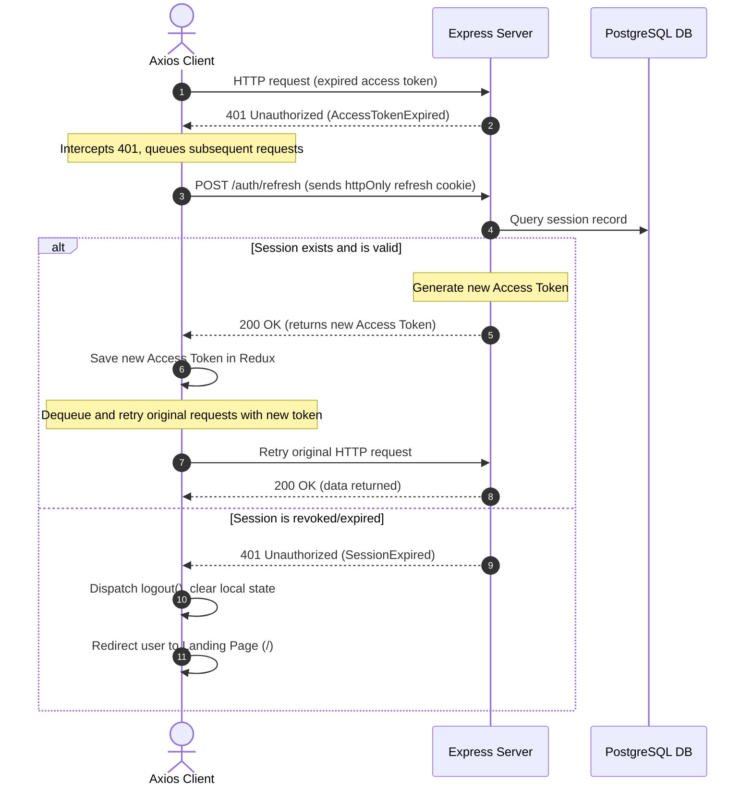
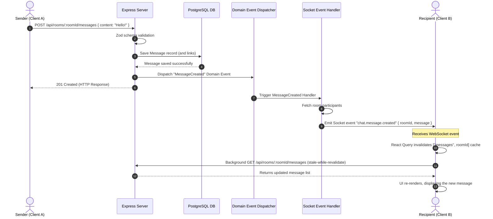

# CONNECT v2 — Comprehensive System Architecture & Developer Reference Manual

Welcome to the internal engineering guide for **CONNECT**. This document details the end-to-end architecture, database structures, data flow pipelines, and technical design patterns governing both the frontend React client and the backend Node/Express clean monolith server.

---

## 1. High-Level Architectural Overview

CONNECT is built as a real-time, interest-driven discussion platform. It coordinates synchronous communication (WebSockets), resilient database persistence (PostgreSQL via Prisma ORM), and client-side server-state management (React Query) under a clean, layered architectural design.



### Core Design Paradigms
1. **Clean Monolith Backend**: Feature-grouped folders containing dedicated route-to-repository layers. Business rules are strictly isolated from HTTP layers and database schemas.
2. **Unidirectional UI Data Flow**: Component interactions dispatch commands through Axios or trigger WebSocket events, which modify the database state. Real-time broadcasts or queries invalidate local React Query caches, prompting React components to re-render.
3. **Database-First Real-time Sync**: The database is the single source of truth. No WebSockets broadcast data until it has been safely committed to the database and processed by backend Event Handlers.

---

## 2. Technology Stack Breakdown & Internal Mechanics

### A. Frontend (React, Redux, React Query, Axios)
- **Vite & React**: Vite provides hot module replacement (HMR) and fast build bundling. React handles component renders declaratively using fiber reconciliation.
- **Redux Toolkit**: Manages synchronous global *client-only state* (such as the authenticated user object, access token, and active UI toggles). Server state (like messages, rooms, and profile data) is intentionally excluded from Redux to prevent duplication.
- **React Query (TanStack Query)**: Handles all *asynchronous server-state caching*. It automates caching, background revalidation (stale-while-revalidate), retry mechanisms, and pagination cursors.
- **Axios**: Standardized HTTP client. Configured with a request interceptor to attach JWT access tokens, and a response interceptor that implements automatic token rotation via token queues when encountering `401 Unauthorized` responses.
- **Framer Motion (`motion/react`)**: Powering key interactive UI animations like the constellation visualizer in `LandingAtlas` and smooth page transitions.

### B. Backend (Node.js, Express.js, Prisma, Socket.IO)
- **Node.js & Express**: Provides a lightweight HTTP server. Employs middleware chains to handle JWT authorization, Zod validation, and centralized exception logging.
- **Prisma ORM**: Directs type-safe database queries. Prisma generates a client wrapper mapping directly to PostgreSQL schemas, mitigating SQL-injection surfaces and N+1 query patterns.
- **PostgreSQL**: Relational database chosen for strict transactional safety (ACID compliance) and complex relational integrity (e.g. cascading deletions on rooms, posts, and user relationships).
- **Socket.IO**: Employs WebSocket-based communication with automatic HTTP long-polling fallback. Enforces token handshakes on client connection, maps sockets to target channels (like `room:id` and `user:id`), and coordinates real-time event broadcasts.

---

## 3. Server-Side Layered Clean Architecture

The server codebase implements a **CQRS-inspired clean architecture** grouped by domain features. Each HTTP request traverses a rigid pipeline:

```
Request 
 ↳ Express Router (e.g., /api/rooms)
   ↳ Zod Validation Middleware (validates request body/query schemas)
     ↳ Controller (extracts params, maps to Command/Query)
       ↳ Application Service / Handler (executes business logic)
         ↳ Repository (abstracts database operations)
           ↳ Prisma Client (queries PostgreSQL)
             ↳ Domain Events (emits event on database success)
               ↳ Event Handler (listens to event, emits Socket broadcast)
                 ↳ Response (HTTP status & data returned to Client)
```

### Server Directory Structure
- [src/config/](file:///Users/sahil/Desktop/INFOSTRIDE/VSCODE/CONNECT/rebuild(v2)/server/src/config): Holds environment variables and database config.
- [src/infrastructure/](file:///Users/sahil/Desktop/INFOSTRIDE/VSCODE/CONNECT/rebuild(v2)/server/src/infrastructure): Connects external drivers (Prisma database client, socket server initializer).
- [src/presentation/](file:///Users/sahil/Desktop/INFOSTRIDE/VSCODE/CONNECT/rebuild(v2)/server/src/presentation): Global routes mount points, JWT and error middlewares.
- [src/shared/](file:///Users/sahil/Desktop/INFOSTRIDE/VSCODE/CONNECT/rebuild(v2)/server/src/shared): Common utilities like loggers and custom error classes.
- [src/features/](file:///Users/sahil/Desktop/INFOSTRIDE/VSCODE/CONNECT/rebuild(v2)/server/src/features): Enforces strict domain segregation:
  - `auth`: Handles session creation, token issuance, encryption, and password recovery.
  - `user`: Manages profiles, updates, and role authorizations.
  - `room`: Controls community rooms, discovery tags, and participant indices.
  - `message`: Manages text messages, attachments, threads, and reactions.
  - `social`: Coordinates friendships, blocks, and presence tracking.
  - `moderation`: Handles flags, reports, and administrative bans.
  - `analytics`: Computes public statistics and platform activity metrics.

---

## 4. Client-Side Directory Structure

The React client app is organized to enforce a strict boundary between UI rendering, business hooks, and API services:

```
rebuild(v2)/client/src/
 ├── components/
 │    ├── features/      # Feature-specific components (landing, chat, profile, etc.)
 │    ├── layout/        # Global wrappers (Navbar, LeftSidebar, AppLayout)
 │    ├── shared/        # Protected routes wrappers
 │    └── ui/            # Reusable UI controls (Button, Input, Badge, Dialog)
 ├── context/            # Shared React context (e.g. ThemeContext)
 ├── hooks/              # Custom business hooks (useAuth, useSocial, useNotifications)
 ├── pages/              # Route entry components (HomeDashboard, WorldChatPage, etc.)
 ├── services/           # Network Clients (apiClient, socketService)
 ├── store/              # Redux slices and store setup
 ├── styles/             # Global CSS files
 └── utils/              # Client-side utility functions (tree, cn)
```

---

## 5. End-to-End Execution & Data Sequences

### A. Bootstrapping Flow (Startup)
When `npm run dev` is executed on the frontend and the backend server starts:



---

### B. Authentication & Token Lifecycle

CONNECT implements standard **JWT session security** using two tokens:
1. **Access Token (Short-lived)**: JSON Web Token containing user ID, role, and username. Transmitted via the HTTP `Authorization: Bearer <token>` header.
2. **Refresh Token (Long-lived)**: Random high-entropy token stored in a database session record and stored in the user's browser inside a secure, `httpOnly`, `SameSite=Strict` cookie. Prevents client-side scripts from reading the refresh token, protecting against Cross-Site Scripting (XSS) attacks.

#### Silent Token Rotation Interceptor Flow
If the short-lived access token expires, the client's Axios response interceptor intercepts the error and resolves it silently:



---

### C. Message Publication & Real-Time Sync Flow

This flow illustrates how a user sends a message in a discussion room and how all other participants receive it instantly:



---

## 6. Critical Security & Performance Guidelines

### A. Preventing N+1 Database Query Overhead
- **Problem**: Querying a list of records (e.g. 20 rooms) and subsequently initiating a database call for each record to fetch its author/replies results in 21 round-trips to the database.
- **Solution**: Always use Prisma's `include` or `select` parameters during the initial query to pre-join tables in PostgreSQL in a single query:
  ```javascript
  prisma.room.findMany({
    include: {
      user: { select: { username: true, avatar: true } },
      _count: { select: { messages: true } }
    }
  });
  ```

### B. Avoiding State Duplication
- Keep server-returned data (messages, active rooms, user lists) inside **React Query**.
- Do not copy server-side query results into the Redux store. Storing server state in Redux creates synchronization bugs and bypasses React Query's garbage collection and automatic caching invalidation.
- Redux must remain dedicated strictly to **client-only local state** (e.g., active modal toggles, client themes, and active access tokens).

### C. Clean WebSocket Disconnections
- Always register event listeners inside React `useEffect` hooks, and ensure that the cleanup function cleans up the listener:
  ```javascript
  useEffect(() => {
    const socket = getSocket();
    const handleEvent = (data) => { ... };
    
    socket.on("custom_event", handleEvent);
    return () => {
      socket.off("custom_event", handleEvent); // Prevents memory leaks
    };
  }, []);
  ```
- Any global WS actions or notifications should be handled in [useGlobalSocketEvents.js](file:///Users/sahil/Desktop/INFOSTRIDE/VSCODE/CONNECT/rebuild(v2)/client/src/hooks/useGlobalSocketEvents.js) rather than duplicated across individual components.
